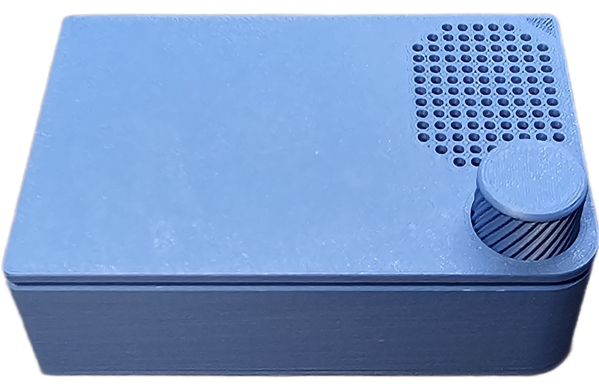
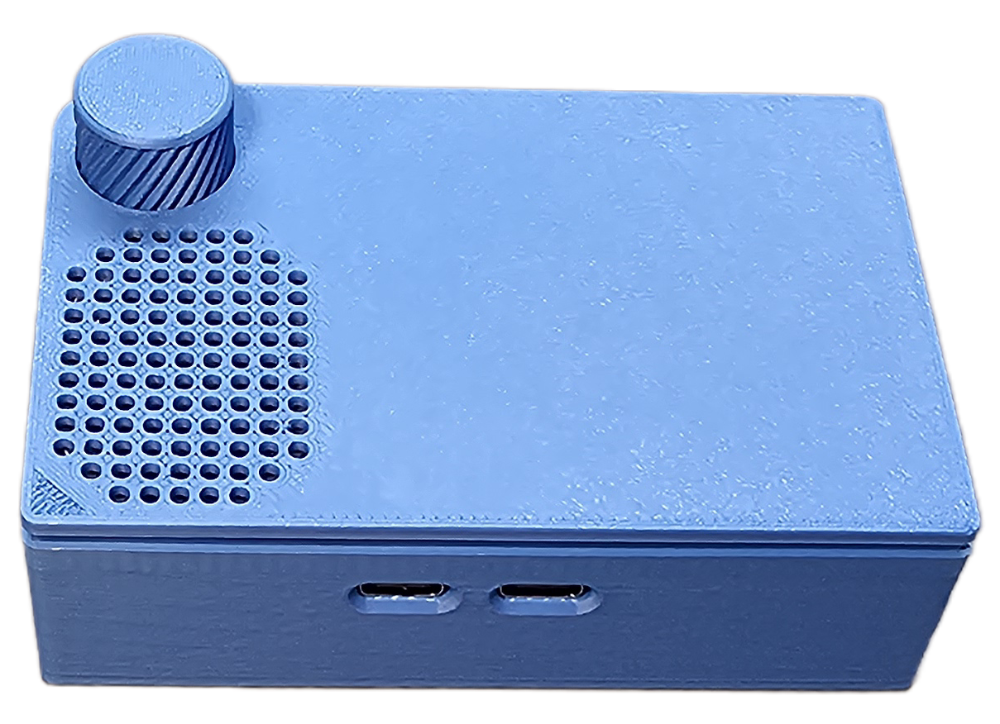
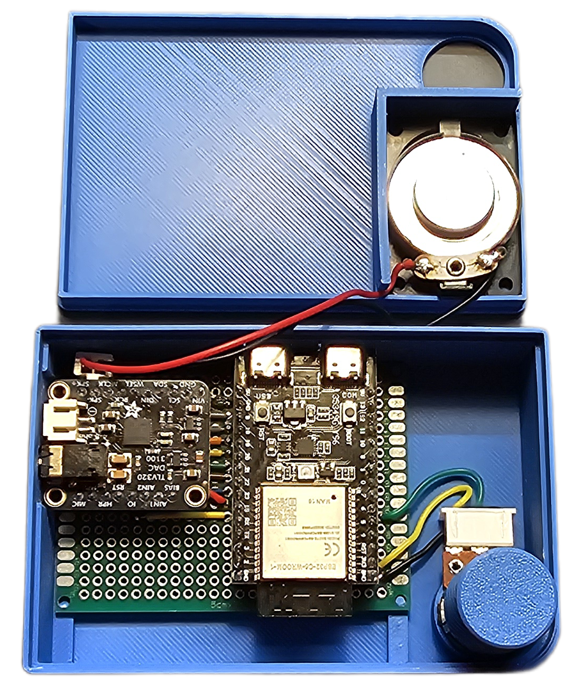

<!-- SPDX-License-Identifier: MIT -->
<!-- Copyright (c) 2025 Leland Lucius -->

# DECtalk ESPress Physical Device

This document describes the perfboard build shown in the repository images.  It
uses an ESP32-C6 development board, an Adafruit TLV320DAC3100 audio breakout, a
small speaker, and a front-panel volume potentiometer to make a self-contained
DECtalk ESPress device.

## Parts

| Part | Notes |
|------|-------|
| Generic ESP32-C6 development board | Provides USB Serial/JTAG for host communication and firmware flashing. |
| Adafruit TLV320DAC3100 audio breakout | I2S DAC, I2C-controlled codec, and class-D speaker amplifier. |
| 3 W 8 Ω mini speaker | Connects directly to the TLV320 speaker outputs. |
| 10 kΩ linear potentiometer | Optional analog volume control. |
| Perfboard | Carries the ESP32-C6 board, audio breakout, and wiring. |

## Build photos and layout

| View | Image |
|------|-------|
| Front |  |
| Back |  |
| Left side |  |
| Right side |  |
| Inside |  |
| Perfboard wiring layout |  |

## Firmware configuration

Configure the firmware for the ESP32-C6 target and the TLV320DAC3100 breakout:

1. Run `idf.py set-target esp32c6`.
2. In `idf.py menuconfig`, select
   *DECtalk ESPress Firmware → Audio output → Audio DAC →
   Adafruit TLV320DAC3100 breakout*.
3. Use the pin assignments in the wiring table below.
4. If using the potentiometer, enable
   *DECtalk ESPress Firmware → Audio output → Analog volume knob
   (potentiometer) → Enable analog volume potentiometer*.

## Wiring

The layout is illustrated in `images/pcb layout.png`.  The following table lists
the same hookups in text form.

### ESP32-C6 to TLV320DAC3100

| ESP32-C6 pin | TLV320DAC3100 pin | Function | Menuconfig setting |
|--------------|-------------------|----------|--------------------|
| 5V | VIN | Breakout power | n/a |
| GND | GND | Ground | n/a |
| GPIO 23 | MCLK | I2S master clock | `DTESP_I2S_MCLK_GPIO=23` |
| GPIO 21 | BCLK | I2S bit clock | `DTESP_I2S_BCK_GPIO=21` |
| GPIO 20 | WCLK | I2S word select / LRCK | `DTESP_I2S_WS_GPIO=20` |
| GPIO 19 | DIN | I2S audio data to codec | `DTESP_I2S_DO_GPIO=19` |
| GPIO 18 | SDA | I2C data | `DTESP_I2C_SDA_GPIO=18` |
| GPIO 9 | SCL | I2C clock | `DTESP_I2C_SCL_GPIO=9` |
| GPIO 22 | RST | Codec reset | `DTESP_CODEC_RESET_GPIO=22` |
| GPIO 15 | GPIO / interrupt | Codec interrupt | `DTESP_CODEC_INT_GPIO=15` |

### Speaker

| Speaker lead | TLV320DAC3100 pin |
|--------------|-------------------|
| Speaker + | SPK+ |
| Speaker - | SPK- |

The TLV320DAC3100 speaker output is a bridge-tied-load amplifier.  Do not connect
either speaker terminal to ground.

### Volume potentiometer

| Potentiometer terminal | ESP32-C6 pin | Function |
|------------------------|--------------|----------|
| One outside lug | 3V3 | ADC high reference |
| Wiper / center lug | GPIO 6 | Volume ADC input (`DTESP_VOLUME_KNOB_GPIO=6`) |
| Other outside lug | GND | ADC low reference |

If the knob works backwards, swap the two outside potentiometer lugs.

## Assembly notes

- Keep the I2S and I2C wires short and route all grounds back to the ESP32-C6
  ground rail.
- Use the TLV320DAC3100 `SPK+` and `SPK-` pins only for the speaker.  Use the
  headphone pins only for headphone output.
- The ESP32-C6 USB connector remains accessible for flashing, logs, and normal
  DECtalk ESPress host communication.
- Power the device down before changing wiring or moving boards on the perfboard.
